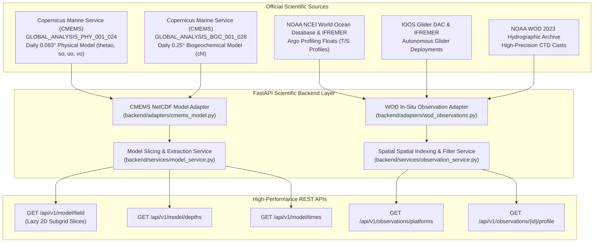
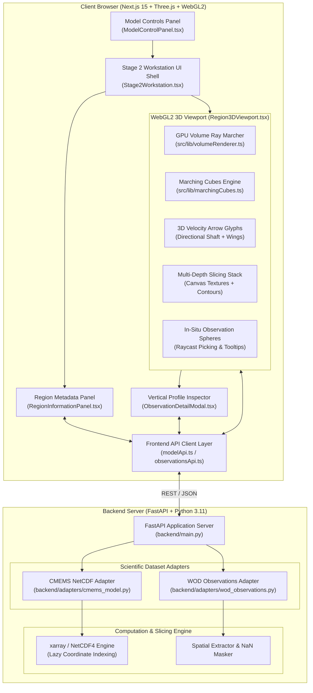
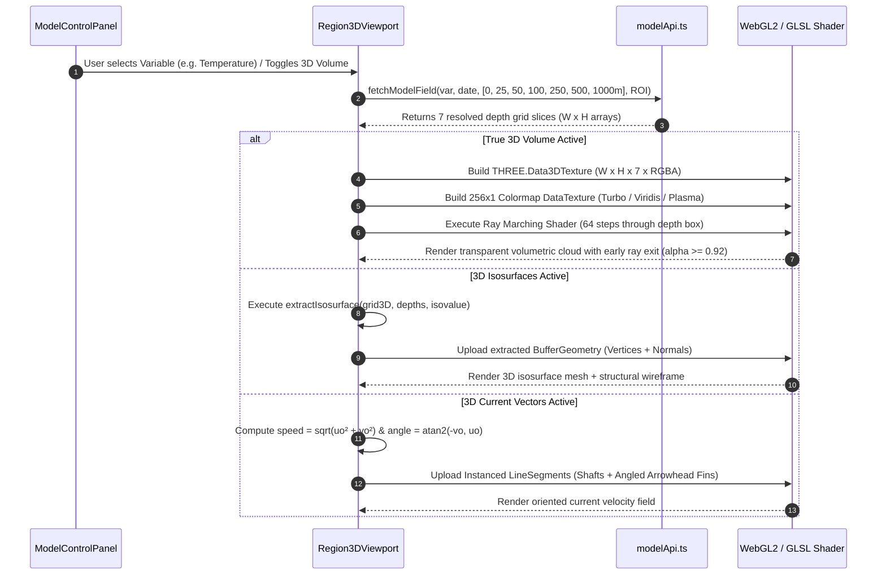

# 🌊 SAGARDRISHTI-3D
### *Interactive Web-Based 3D Ocean Model & In-Situ Observation Exploration Platform*

[](https://www.sih.gov.in/)
[](https://incois.gov.in/)
[](https://nextjs.org/)
[](https://fastapi.tiangolo.com/)
[](https://threejs.org/)
[](https://docs.xarray.dev/)
[](https://www.typescriptlang.org/)
[-10b981?style=for-the-badge&logo=pytest&logoColor=white)](#-testing--quality-assurance)

---

## 📌 Executive Summary

**SagarDrishti-3D** is an advanced scientific oceanographic exploration workstation engineered for **Smart India Hackathon (SIH 2026) Problem Statement 26067**, sponsored by the **Indian National Centre for Ocean Information Services (INCOIS)**, Ministry of Earth Sciences (MoES), Government of India.

The platform bridges discrete in-situ marine observations with continuous 4D numerical ocean model outputs across the Indian Ocean Basin (Arabian Sea, Bay of Bengal, and Equatorial Indian Ocean). Utilizing WebGL2 GPU volume ray marching, standalone 3D Marching Cubes isosurface extraction, discrete multi-depth horizontal slicing, and true 3D current vector fields, **SagarDrishti-3D** delivers real-time scientific visualization with sub-second rendering latencies.

> 📸 *Project Walkthrough / Interactive Demo GIF*
> *(Add project demo GIF or video walkthrough here: `docs/assets/demo_walkthrough.gif`)*

---

## 🧭 Problem Statement (SIH PS 26067)

### Context & Challenges
The Indian Ocean is one of the most dynamically complex marine domains in the world, governed by semiannual monsoon reversals, intense tropical cyclone tracks, variable salinity gradients, and localized upwelling systems. Oceanographers, forecasters, and researchers at INCOIS handle immense volumes of multi-dimensional data originating from:
1. **Numerical Hydrodynamic & Biogeochemical Models:** High-resolution gridded datasets containing continuous 3D water-column variables ($x, y, z, t$).
2. **In-Situ Marine Observation Platforms:** Discrete Lagrangian and Eulerian observations from **Argo profiling floats**, **autonomous underwater gliders**, **CTD (Conductivity-Temperature-Depth) casts**, and **BGC (Biogeochemical) sensor arrays**.

### Key Technical Bottlenecks
* **Dimensional Disconnect:** Traditional marine portals rely on static 2D surface maps or isolated 2D vertical transect plots, obscuring internal 3D structures such as thermoclines, barrier layers, and underwater current jets.
* **Volume Representation Limitations:** Standard web GIS tools lack native GPU ray marching capabilities for multi-depth scalar NetCDF grids.
* **Observation-Model Gap:** In-situ profiles and 3D hydrodynamic model fields are frequently sequestered in distinct tools, preventing unified spatial correlation.

---

## 💡 The SagarDrishti-3D Solution

SagarDrishti-3D provides a unified two-stage interactive workstation:

```
┌────────────────────────────────────────────────────────────────────────────────────────┐
│                                 SAGARDRISHTI-3D WORKSTATION                             │
├──────────────────────────────────────────┬─────────────────────────────────────────────┤
│   STAGE 1: GLOBAL DIGITAL EARTH           │   STAGE 2: 3D REGIONAL WORKSTATION          │
│   • Global 3D Interactive Globe          │   • True 3D Volumetric Ray Marching         │
│   • 27,000+ Real In-Situ Marine Profiles │   • 3D Marching Cubes Isosurfaces           │
│   • Country Boundaries & Bathymetry      │   • Real Depth Slices (0m to 1000m)         │
│   • Interactive Bounding Box ROI Select  │   • True 3D Velocity Vectors (uo, vo)       │
│   • Global Scalar Layer Overlays         │   • Interactive Profile Inspection Modals   │
│   • Fast Spatial Bounding Box Filtering  │   • 1× to 10× Vertical Exaggeration         │
└──────────────────────────────────────────┴─────────────────────────────────────────────┘
```

---

## 🌟 Key Features & Capabilities

### 🌍 1. Stage 1 — Global Digital Earth Overview
* **Global Marine Globe:** High-performance 3D Earth sphere with real country boundaries, atmospheric scattering shaders, and regional coastlines.
* **Fleet-Wide Observation Tracking:** Interactive rendering of thousands of in-situ marine platforms across the Indian Ocean basin with distinct visual taxonomy:
  * 🟢 **Argo Profiling Floats** (Temperature & Salinity up to 2000m)
  * 🔵 **Underwater Gliders** (High-resolution sawtooth spatial transects)
  * 🟠 **Shipboard CTD Casts** (Deep hydrographic stations)
  * 🟣 **Biogeochemical (BGC) Floats** (Chlorophyll-a & bio-optical sensors)
* **Interactive Bounding Box ROI Selector:** Click-and-drag spatial region selector defining custom latitude/longitude regions of interest for deep 3D analysis.

### 🧊 2. Stage 2 — Depth-Resolved 3D Ocean Model Workstation
* **True 3D Volumetric GPU Ray Marching:** Direct ray casting through a 3D scientific data texture with front-to-back emission-absorption compositing and early ray termination.
* **Marching Cubes Isosurface Extraction:** Real-time extraction of continuous 3D constant-value surfaces (thermocline isotherms, halocline fronts, and chlorophyll plumes) with dynamic isovalue threshold sliders.
* **7-Level Depth Slicing Stack:** Interactive multi-depth horizontal planes ($0\text{m}, 25\text{m}, 50\text{m}, 100\text{m}, 250\text{m}, 500\text{m}, 1000\text{m}$) with individual depth contour borders.
* **True 3D Current Velocity Vectors:** Horizontal flow field glyphs derived from zonal ($u_o$) and meridional ($v_o$) velocities with true vector magnitude scaling ($\text{speed} = \sqrt{u_o^2 + v_o^2}$) and bilateral arrowhead fins.
* **Vertical Exaggeration Control:** Smooth $1\times \to 10\times$ depth exaggeration slider that expands physical vertical separation without altering underlying coordinate metadata.
* **Full-Page 3D Viewport Expansion:** Bottom-left `⛶ Maximize` / `🗗 Minimize` control enabling distraction-free full-screen 3D exploration with zero canvas distortion.
* **Temporal Playback Engine:** Time scrubbing across daily model forecasts from 01 Jan 2026 to 31 Mar 2026 with synchronized model data caching.
* **Dual-Mode 3D Interaction:**
  * ✋ **Hand Tool Mode:** Orbit rotation, planar panning, and distance zooming.
  * 🎯 **Marker Selection Mode:** Raycasting against in-situ observation spheres to open high-resolution vertical profile inspection graphs.

---

## 📊 PS 26067 Requirement Compliance Matrix

| PS 26067 Requirement | Implemented Mechanism in SagarDrishti-3D | Verification Status |
| :--- | :--- | :---: |
| **3D Volumetric Ocean Rendering** | WebGL2 GPU ray marching through `THREE.Data3DTexture` with transfer function colormaps and early ray termination | ✅ Implemented |
| **Model Scalar Variables** | Potential Temperature (`thetao`), Practical Salinity (`so`), and Chlorophyll-a (`chl`) | ✅ Implemented |
| **Horizontal Ocean Currents** | Zonal ($u_o$) and Meridional ($v_o$) vector field with $\text{speed} = \sqrt{u_o^2 + v_o^2}$ and $\theta = \text{atan2}(v_o, u_o)$ | ✅ Implemented |
| **Depth Resolution** | Multi-level discrete depth planes spanning $0\text{m} \to 1000\text{m}$ ($0, 25, 50, 100, 250, 500, 1000\text{m}$) | ✅ Implemented |
| **3D Isosurfaces** | Standalone 3D Marching Cubes algorithm with 256-entry edge/triangulation lookup table and dynamic isovalue slider | ✅ Implemented |
| **Depth Slicing Stack** | Coordinated multi-plane and single-plane depth slicing with contour outlines | ✅ Implemented |
| **Vertical Exaggeration** | Real-time $1\times \to 10\times$ depth scaling applied dynamically across meshes, cage, and vectors | ✅ Implemented |
| **Time Slider / Playback** | Daily time step navigation (90 days) with synchronized model plane retrieval | ✅ Implemented |
| **In-Situ Platform Tracking** | Argo floats, autonomous gliders, shipboard CTDs, and BGC platforms with spatial ROI filtering | ✅ Implemented |
| **Vertical Profile Graphs** | Interactive SVG profile modal charting temperature and salinity vs. depth down to $2000\text{m}$ | ✅ Implemented |
| **Scientific Data Ingestion** | FastAPI backend with CF-compliant NetCDF4/xarray lazy reading and spatial bounding-box slicing | ✅ Implemented |
| **Scientific Color Scales** | Perceptually uniform colormaps: **Turbo** (Temperature/Currents), **Viridis** (Salinity), **Plasma** (Chlorophyll) | ✅ Implemented |
| **Data Status Inspection** | Header popover displaying authoritative model and in-situ provenance without fake live timers | ✅ Implemented |
| **OGC WMS / WCS Support** | Modular adapter architecture designed for OGC standard integration | ⏳ Architecture Ready |

---

## 🔬 Scientific Data Pipeline & Provenance

SagarDrishti-3D relies exclusively on scientifically validated, official marine data sources. The platform strictly distinguishes between **real official data snapshots** and **live streaming data**, maintaining provenance integrity.



### Scientific Variable Specifications

| UI Variable | Model Parameter | Source Dataset | Physical Unit | Scientific Range | Colormap Palette |
| :--- | :--- | :--- | :---: | :---: | :---: |
| **Temperature** | `thetao` (Potential Temperature) | CMEMS Global Physics Daily | $^\circ\text{C}$ | $1.5^\circ\text{C} \to 32.0^\circ\text{C}$ | **Turbo** (Blue $\to$ Red) |
| **Salinity** | `so` (Practical Salinity) | CMEMS Global Physics Daily | $\text{PSU}$ ($10^{-3}$) | $32.0 \to 37.0\text{ PSU}$ | **Viridis** (Purple $\to$ Yellow) |
| **Currents (Speed)** | $\sqrt{u_o^2 + v_o^2}$ | CMEMS Global Physics Daily | $\text{m/s}$ | $0.00 \to 1.50\text{ m/s}$ | **Turbo** (Blue $\to$ Red) |
| **Currents (Direction)** | $\text{atan2}(v_o, u_o)$ | CMEMS Global Physics Daily | Radians / Deg | $-\pi \to +\pi$ | Oriented 3D Arrows |
| **Chlorophyll-a** | `chl` (Mass Concentration) | CMEMS Global BGC Daily | $\text{mg/m}^3$ | $0.02 \to 2.00\text{ mg/m}^3$ | **Plasma** (Purple $\to$ Orange) |

---

## 🏗️ Technical Architecture

### Full-Stack Architecture Diagram



---

## 🖥️ 3D Rendering Pipeline Deep-Dive



### 1. True 3D Volumetric Ray Marching (`src/lib/volumeRenderer.ts`)
* **Data Texture Architecture:** Packs loaded depth slices into a 3D texture (`THREE.Data3DTexture`, $W \times H \times D \times 4$).
  * **R Channel:** Normalized scientific scalar magnitude ($0 \to 255$).
  * **A Channel:** Ocean/Land mask ($255 = \text{valid ocean data}$, $0 = \text{land / NaN missing data}$).
* **Shader Ray Traversal:** The fragment shader computes camera ray entry and exit intersections on a bounding box mesh (`THREE.BoxGeometry`). It marches 64 discrete sample intervals in normalized texture coordinates $[0, 1]^3$.
* **Transfer Function & Compositing:** Samples are mapped through a 1D colormap lookup texture and blended using front-to-back emission-absorption compositing:
  $$C_{\text{acc}} = C_{\text{acc}} + (1.0 - \alpha_{\text{acc}}) \cdot C_{\text{sample}} \cdot \alpha_{\text{sample}}$$
  $$\alpha_{\text{acc}} = \alpha_{\text{acc}} + (1.0 - \alpha_{\text{acc}}) \cdot \alpha_{\text{sample}}$$
* **Early Ray Termination:** Ray traversal halts when $\alpha_{\text{acc}} \ge 0.92$, preventing unnecessary GPU cycles in dense internal regions.

### 2. Standalone Marching Cubes Isosurfaces (`src/lib/marchingCubes.ts`)
* **Algorithmic Implementation:** Standalone TypeScript implementation containing full 256-case edge table and 16-entry triangulation lookup matrices.
* **Non-Uniform Depth Mapping:** Maps irregular ocean depth planes ($0\text{m}, 25\text{m}, 50\text{m}, 100\text{m}, \dots$) to continuous Cartesian vertical coordinates ($Y \in [0, -\text{verticalExaggeration}]$).
* **Gradient Normal Estimation:** Calculates smooth surface vertex normals via central differences for realistic directional light reflection.

### 3. Real 3D Current Vectors
* **Zonal & Meridional Vector Calculus:**
  $$\text{speed} = \sqrt{u_o^2 + v_o^2} \quad (\text{m/s}), \quad \theta = \text{atan2}(v_o, u_o)$$
* **Glyph Geometry:** Each current vector is rendered with a main directional shaft and two backward-angled arrowhead fins ($\pm 145^\circ$) for unambiguous heading representation.
* **Dynamic Density Sampling:** The `Vector Density` slider ($10\% \to 100\%$) modulates the spatial grid stride ($6 \to 1$) in-memory with **zero network overhead**.

---

## 📂 Repository Structure

```text
.
├── backend/                              # High-Performance FastAPI Scientific Backend
│   ├── adapters/                         # Dataset ingest & parsing adapters
│   │   ├── base.py                       # Base abstract observation/model classes
│   │   ├── cmems_model.py                # Copernicus NetCDF4 daily model adapter
│   │   ├── wod_observations.py           # NOAA World Ocean Database & Argo adapter
│   │   └── csv_adapter.py                # CSV observation ingest adapter
│   ├── routers/                          # API route definitions
│   │   ├── model.py                      # /api/v1/model endpoints
│   │   └── observations.py               # /api/v1/observations endpoints
│   ├── schemas/                          # Pydantic schemas (model and observation contracts)
│   ├── services/                         # Spatial extraction and slicing services
│   ├── tests/                            # Automated Pytest suite (17 comprehensive tests)
│   │   ├── conftest.py                   # NetCDF mock fixtures & test client
│   │   └── test_api.py                   # Endpoint, coordinate, and error test cases
│   ├── config.py                         # Environment and path configurations
│   ├── Dockerfile.backend                # Container specification for backend
│   ├── main.py                           # FastAPI application entry point
│   └── requirements.txt                  # Python dependencies
├── src/                                  # Next.js 15 & React 19 Frontend Application
│   ├── components/                       # User interface & visualization components
│   │   ├── Globe.tsx                     # Landing page 3D globe component
│   │   └── page3/                        # Stage 1 & Stage 2 Workstation architecture
│   │       ├── globe/                    # Global Digital Earth components (EarthSphere, Glow, etc.)
│   │       ├── stage2/                   # 3D Selected Region components
│   │       │   ├── ModelControlPanel.tsx # Visualization & model control panel
│   │       │   ├── Region3DViewport.tsx  # Core WebGL2 3D Viewport coordinator
│   │       │   ├── RegionInformationPanel.tsx # Regional metadata & observation summary
│   │       │   └── Stage2Workstation.tsx # 3-column workstation coordinator
│   │       ├── ObservationDetailModal.tsx # In-situ profile inspector modal
│   │       ├── ObservationProfileChart.tsx # SVG vertical profile chart (T/S vs. Depth)
│   │       ├── Page3Workstation.tsx      # Stage 1 & 2 switcher shell
│   │       └── page3Config.ts            # Palette, timeline, and depth constants
│   ├── lib/                              # Frontend core utilities & math engines
│   │   ├── colormaps.ts                  # Turbo, Viridis, Plasma colormap generators
│   │   ├── marchingCubes.ts              # Standalone 3D Marching Cubes algorithm
│   │   ├── modelApi.ts                   # Regional model slice API client
│   │   ├── observationsApi.ts            # In-situ observation API client
│   │   ├── store.ts                      # Zustand global application state
│   │   └── volumeRenderer.ts             # GPU Volume Ray-Marching shader pipeline
│   ├── scene/                            # Reusable Three.js shaders, lighting, and meshes
│   └── ui/                               # Shared UI elements, modals, and manuals
├── app/                                  # Next.js App Router pages
│   ├── explore/page.tsx                  # Main explorer entry point (/explore)
│   ├── globals.css                       # Tailwind CSS & custom design tokens
│   ├── layout.tsx                        # Root layout with fonts and metadata
│   └── page.tsx                          # Cinematic landing page
├── public/                               # Static assets, textures, and country vector lines
├── docs/                                 # Architectural documentation & API contracts
├── docker-compose.yml                    # Multi-container orchestration
├── Dockerfile.frontend                   # Frontend container specification
├── package.json                          # Node.js dependencies & build scripts
└── tsconfig.json                         # Strict TypeScript compiler options
```

---

## 🚀 Quickstart & Setup Guide

### Prerequisites
* **Node.js:** v18.18.0+ or v20+
* **Package Manager:** `pnpm` (recommended) or `npm`
* **Python:** v3.10 or v3.11+
* **Modern Web Browser:** Chrome, Edge, Firefox, or Safari with WebGL2 support.

---

### Step 1: Clone Repository
```bash
git clone https://github.com/sihfinal/sagardrishti-3d.git
cd sagardrishti-3d
```

---

### Step 2: Backend Setup (FastAPI)

1. Navigate to the project root and set up a Python virtual environment:
   ```bash
   python -m venv .venv
   ```

2. Activate the virtual environment:
   * **Windows (PowerShell):**
     ```powershell
     .\.venv\Scripts\Activate.ps1
     ```
   * **macOS / Linux:**
     ```bash
     source .venv/bin/activate
     ```

3. Install backend dependencies:
   ```bash
   pip install -r backend/requirements.txt
   ```

4. Launch the FastAPI server:
   ```bash
   uvicorn backend.main:app --host 0.0.0.0 --port 8000 --reload
   ```
   *API will be active at:* `http://localhost:8000`  
   *Interactive OpenAPI Docs:* `http://localhost:8000/docs`

---

### Step 3: Frontend Setup (Next.js)

1. Open a new terminal in the repository root.
2. Install frontend dependencies:
   ```bash
   pnpm install
   ```

3. Start the Next.js development server:
   ```bash
   pnpm dev
   ```
   *Application will be live at:* `http://localhost:3000`

---

### Step 4: Docker Compose Deployment (Alternative)

To deploy the entire production stack (Frontend + Backend) in isolated containers:
```bash
docker-compose up -d --build
```
* **Frontend:** `http://localhost:3000`
* **Backend API Docs:** `http://localhost:8000/docs`

---

## 🧪 Testing & Quality Assurance

The codebase is strictly validated through automated unit tests, type-checkers, and runtime integrity scripts.

```bash
# 1. Run Python Backend Test Suite (Pytest)
pytest backend/tests

# 2. Run TypeScript Static Type Validation
npx tsc --noEmit
```

### Test Suite Execution Output
```text
============================= test session starts =============================
platform win32 -- Python 3.11.5, pytest-9.0.1, pluggy-1.6.0
rootdir: C:\...\sagardrishti-3d
collected 17 items

backend\tests\test_api.py .................                              [100%]

======================== 17 passed, 1 warning in 7.78s ========================
```

---

## 📡 REST API Reference

The backend provides high-performance, cached endpoints for lazy spatial slicing and observation querying:

### Model Endpoints (`/api/v1/model`)
* `GET /api/v1/model/metadata` — Get dataset bounding coordinates, time steps, and available variables.
* `GET /api/v1/model/times` — List available forecast timestamps (`YYYY-MM-DD`).
* `GET /api/v1/model/depths` — Return discrete vertical depth levels in meters.
* `GET /api/v1/model/field` — Lazy 2D subgrid extraction for a specified variable, timestamp, depth, and spatial ROI:
  ```text
  Query Parameters:
    variable  : temperature | salinity | currents | u_velocity | v_velocity | chlorophyll
    time      : YYYY-MM-DD (e.g., 2026-02-15)
    depth     : float (e.g., 250.0)
    lat_min   : float (-18.0)
    lat_max   : float (-5.0)
    lon_min   : float (65.0)
    lon_max   : float (85.0)
    stride    : int (1 to 8, default: 1)
  ```

### Observation Endpoints (`/api/v1/observations`)
* `GET /api/v1/observations/platforms` — Query in-situ platforms within spatial bounding coordinates.
* `GET /api/v1/observations/{platform_id}/profile` — Retrieve depth-resolved observation profile arrays (`depth`, `temperature`, `salinity`).

---

## 🖼️ Visual Showcase & Screenshots

<div align="center">
  <table>
    <tr>
      <td width="50%" align="center">
        <b>🌍 Stage 1: Global Digital Earth & Fleet Tracking</b><br>
        <br>
        <i>Interactive 3D Earth with country lines and 27,000+ in-situ profiles.</i>
      </td>
      <td width="50%" align="center">
        <b>🧊 Stage 2: True 3D Volumetric Ray Marching</b><br>
        <br>
        <i>GPU ray-marched thermal structure with continuous depth scalar gradients.</i>
      </td>
    </tr>
    <tr>
      <td width="50%" align="center">
        <b>🌀 3D Horizontal Current Vectors</b><br>
        <br>
        <i>Directional velocity vectors with magnitude-scaled shafts and arrowhead fins.</i>
      </td>
      <td width="50%" align="center">
        <b>📈 In-Situ Observation Profile Inspector</b><br>
        <br>
        <i>Interactive profile graphs comparing in-situ temperature and salinity down to 2000m.</i>
      </td>
    </tr>
  </table>
  <p><i>📸 Screenshot placeholders — replace paths in <code>docs/assets/</code> with deployment captures.</i></p>
</div>

---

## 🛠️ Technology Stack

```
┌────────────────────────────────────────────────────────────────────────┐
│                          SAGARDRISHTI-3D STACK                         │
├──────────────────────┬─────────────────────────────────────────────────┤
│ Frontend Framework   │ Next.js 15 (App Router), React 19, TypeScript   │
│ 3D & Graphics        │ Three.js (r128+), WebGL2, Custom GLSL Shaders   │
│ Styling & Motion     │ Tailwind CSS, Framer Motion, Lucide Icons       │
│ State Management     │ Zustand (Lightweight Global Store)              │
│ Backend Framework    │ FastAPI (Python 3.11+), Uvicorn ASGI            │
│ Scientific Libraries │ xarray, NetCDF4, NumPy, SciPy                   │
│ Testing & QA         │ Pytest, Strict TypeScript Compiler              │
│ Containerization     │ Docker, Docker Compose, NGINX Alpine            │
└──────────────────────┴─────────────────────────────────────────────────┘
```

---

## ⚠️ Known Limitations & Future Roadmap

### Current Scope & Limitations
1. **Local Snapshot Integration:** Numerical model fields and in-situ observations are ingested from local NetCDF and WOD archives rather than live automated GTS feeds.
2. **OGC Interoperability:** WMS and WCS server capabilities are currently architecture-ready but not exposed as public OGC web endpoints.
3. **GPU Hardware Dependency:** WebGL2 volume ray marching performance scales with client GPU hardware capabilities.

### Future Roadmap
- [ ] **OGC WMS/WCS Service Implementation:** Native endpoint support for OGC-compliant GIS clients (QGIS, ArcGIS).
- [ ] **Automated GTS/FTP Ingestion Pipelines:** Continuous cron worker ingesting live daily Copernicus and WMO GTS telegrams.
- [ ] **Ensemble Forecast Spread Visualizer:** Probabilistic 3D isosurface cones for tropical cyclone surge prediction.
- [ ] **VR / Immersive Spatial Headset Support:** WebXR integration for immersive oceanographic analysis.

---

## 🤝 Acknowledgements & Citations

* **INCOIS (Indian National Centre for Ocean Information Services):** For problem definition, operational oceanographic guidance, and domain requirements under SIH PS 26067.
* **Copernicus Marine Service (CMEMS):** For CF-compliant global ocean physics and biogeochemical daily analysis products.
* **NOAA NCEI & IFREMER:** For global in-situ World Ocean Database (WOD) and international Argo float archives.
* **Ministry of Earth Sciences (MoES), Govt. of India:** For supporting student ocean science and technological innovation.

---

## 📄 License

This project is developed for **Smart India Hackathon (SIH 2026)** under Problem Statement **SIH26067**.  
Released under the **[MIT License](LICENSE)**.

<div align="center">
  <sub>Built for the Ministry of Earth Sciences & INCOIS · SIH PS 26067</sub>
</div>
